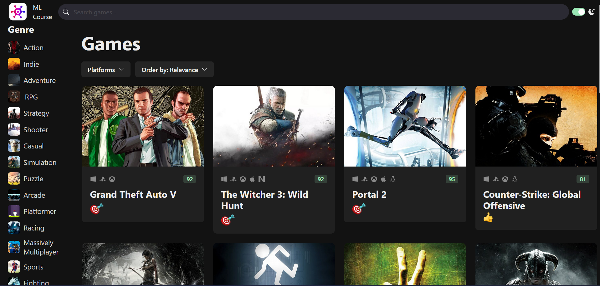

# GameHub  a clone of rawg video game website

## check out my work <a href='https://react-mosh-game-hub-kappa.vercel.app/'>here</a>.

## Getting Started

To get started, follow these steps:

1. Clone this repository to your local machine.
2. Run `npm install` to install the required dependencies.
3. Get a free RAWG API key at https://rawg.io/apidocs. You'll have to create an account first.
4. Add the API key to **src/services/api-client.ts**
5. Run `npm run dev` to start the web server.
